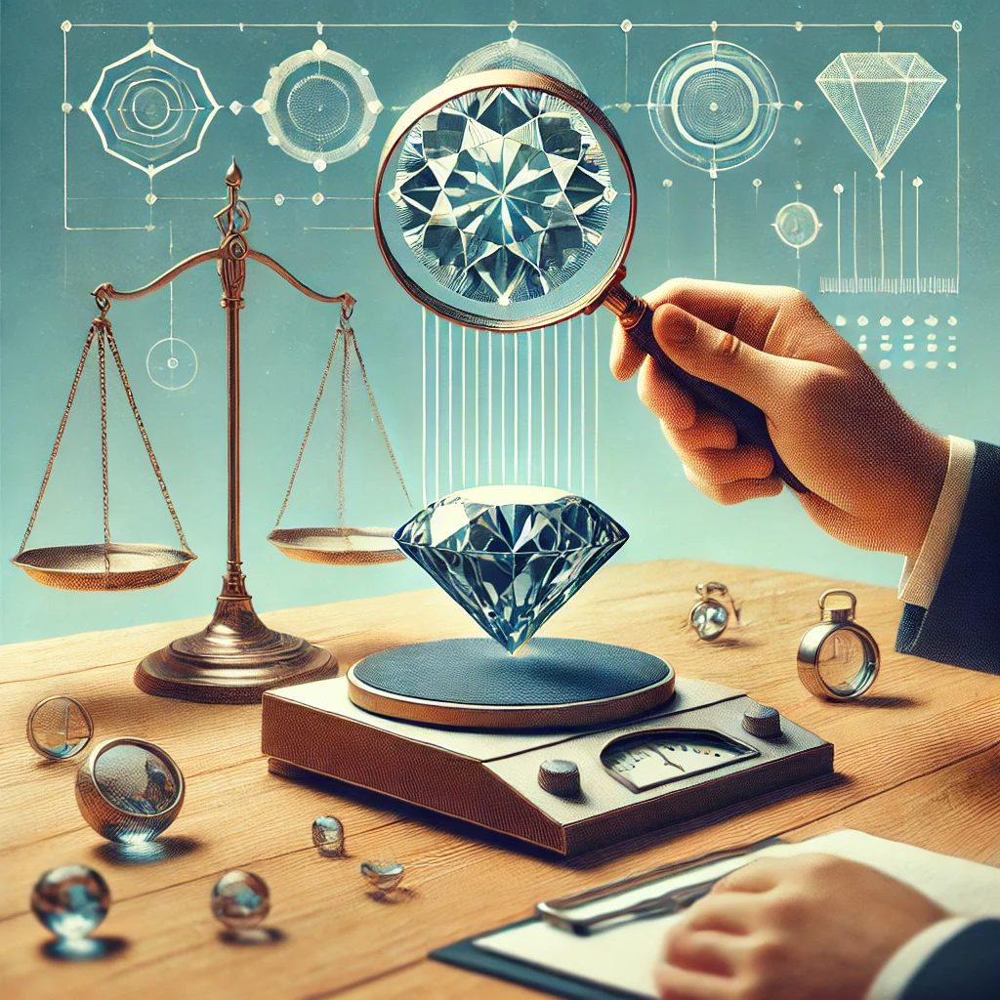

# appraise

## appraise という単語の意味を、例文とあわせて教えてください

appraiseは「評価する」「査定する」という意味の動詞です。特に価値や質を専門的・客観的に判断する際によく使われます。

主な用法と例文をご紹介します：

 * 物の価値を査定する "The jeweler carefully appraised the diamond ring before making an offer." (宝石商はダイヤの指輪を慎重に査定してから、買取価格を提示した)
 * 状況や業績を評価する "Managers meet quarterly to appraise each employee's performance." (マネージャーは四半期ごとに集まり、従業員の業績を評価する)
 * 芸術作品を鑑定する "Art experts were called in to appraise the newly discovered painting." (新たに発見された絵画を鑑定するため、美術の専門家が招かれた)
 * 不動産を査定する "We need to have our house appraised before putting it on the market." (家を市場に出す前に、査定を受ける必要がある)

なお、名詞形は「appraisal」で、「査定」「評価」という意味になります。
"The bank requires a professional appraisal before approving a mortgage."
(銀行は住宅ローンを承認する前に、専門家による査定を必要とする)

## 語源を教えてください

appraiseの語源は以下の通りです：

中世フランス語の「appriser」が起源です

 * ap- (to) + priser (価値をつける、評価する)

さらに遡ると、ラテン語の「appretiare」にたどり着きます

 * ap- (to) + pretium (価格、価値)

英語に入ってきたのは14世紀頃とされています

関連語の「praise（褒める）」と「price（価格）」も同じラテン語「pretium」から派生しており、もともとは「価値を定める」という意味から発展していきました。

現代でも「価値を評価する」という原義が保たれており、特に専門家による客観的な評価を表す際に使われます。

この語源的背景から、appraiseは単なる主観的な評価ではなく、価値や値段を決めるための専門的な判断という意味合いが強くなっています。

## appraise という単語にまつわる、興味深いエピソードはありますか？

appraiseにまつわる興味深いエピソードをいくつかご紹介します：

 * アンティーク・ロードショーでの驚きの査定 イギリスやアメリカで人気の「Antiques Roadshow」というテレビ番組では、一般の人々が持ち込んだ品物をappraiserが査定します。2019年、ある女性が祖母から受け継いだ古い花瓶を持ち込んだところ、実は1920年代のルネ・ラリック作の希少な作品と判明。appraiseの結果、25万ドルという驚きの評価額が付きました。普段何気なく使っていた花瓶が、専門家の「appraise」によって宝物だと分かった瞬間でした。
 * 美術品査定での歴史的発見 2016年、フランスのある家族が屋根裏から見つけた古い絵画をappraiserに見せたところ、それはカラバッジョの失われた傑作「ジュディスとホロフェルネス」である可能性が高いと判定されました。専門家による慎重なappraiseの結果、1600年代初頭の作品と確認され、美術史に大きな発見をもたらしました。
 * 不動産査定における逸話 1970年代のニューヨークで、トランプ家が所有していた不動産のappraiseをめぐって興味深い出来事がありました。当時の査定額が実際の価値よりも意図的に低く見積もられていたことが後に判明し、不動産査定の重要性と、appraiseという行為の客観性・公平性の重要性を示す象徴的な事例となりました。

これらのエピソードは、専門家による「appraise」が、単なる価値判断以上の重要な意味を持ち、時には歴史を動かすような発見につながる可能性があることを示しています。

なお、このような非常に具体的なエピソードについては、私の情報が完全に正確でない可能性があることをお伝えしておく必要があります。

---
Claude 3.5 Sonnet
