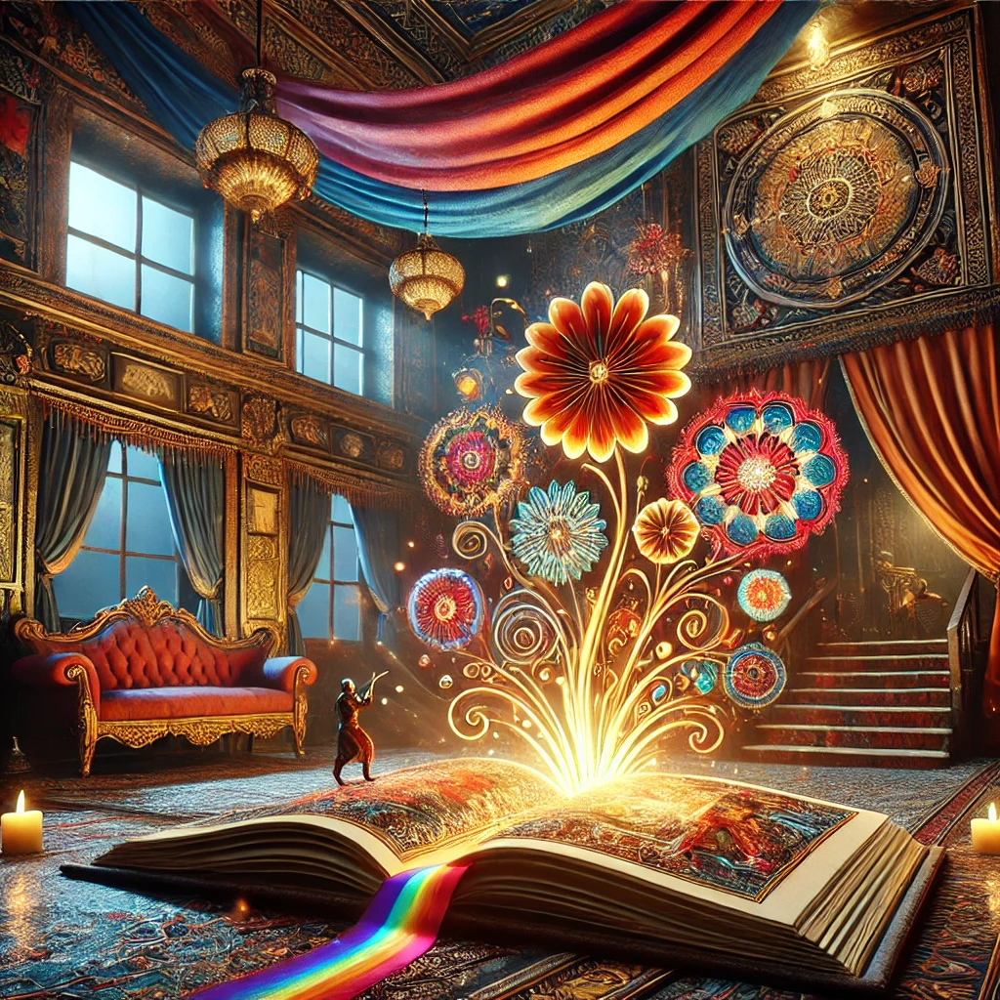

# embellish

> embellish という単語の意味を教えてください

embellishは「装飾する」「飾り立てる」「（話や物語を）脚色する」という意味を持つ動詞です。

主な用法は以下のようなものがあります：

 * 物理的な装飾の意味：
   * "She embellished the cake with flowers and pearls." (彼女はケーキを花や真珠で飾り付けた)
 * 話や物語を脚色する、誇張する意味：
   * "He tends to embellish his stories to make them more interesting." (彼は話をより面白くするために脚色する傾向がある)
 * 音楽やデザインを装飾する意味：
   * "The pianist beautifully embellished the simple melody." (ピアニストはシンプルなメロディーを美しく装飾した)

「embellishment」という名詞形もあり、これは「装飾」「飾り」「脚色」という意味で使われます。

> この単語についての、何か面白いエピソードはありますか？

はい、embellishには歴史的に興味深いエピソードがあります。

中世ヨーロッパの写本文化において、「embellishment」は非常に重要な芸術的要素でした。特に「イルミネーted マニュスクリプト」（装飾写本）と呼ばれる豪華な手書きの本では、テキストの最初の文字（イニシャル）を金箔や鮮やかな色で大きく装飾することが一般的でした。この装飾文字は「illuminated initial」と呼ばれ、時には1ページ全体を使用するほど豪華なものもありました。

面白いのは、これらの装飾は単なる見た目の美しさだけでなく、実用的な目的も持っていたことです。当時は段落や章の区切りを示す現代のような記号体系が確立されていなかったため、この「embellishment」は読者が文章の構造を理解するための重要な視覚的手がかりとしても機能していました。

また、中世の写字生たちは時々、余白に小さな絵や落書きのような「embellishment」を加えることがありました。これらの中には、当時の人々のユーモアセンスを垣間見ることができる愉快な絵（例えば、騎士と戦う巨大なウサギなど）も含まれており、現代の研究者たちの注目を集めています。

このように、embellishという言葉は、実用性と芸術性、そして時にはユーモアまでも含む豊かな歴史的背景を持っているのです。

---
Claude 3.5 Sonnet で生成
