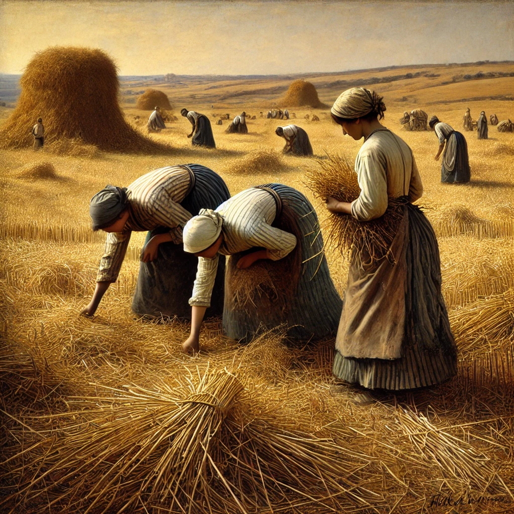

# glean

## glean という単語の意味を、例文とあわせて教えてください

gleanには主に2つの重要な意味があります：

「（情報や事実を）少しずつ集める、収集する」という意味 例文：

 * From his diary, we can glean information about life in the 19th century. （彼の日記から、19世紀の生活についての情報を少しずつ集めることができます）
 * The detective managed to glean some useful details from the witnesses. （探偵は証人たちから有用な詳細を収集することができました）

「（収穫後の畑から）落ち穂を拾う」という意味 例文：

 * After the harvest, poor families would glean the remaining grain from the fields. （収穫後、貧しい家族たちは畑に残った穀物を拾い集めていました）
 * Farmers allowed locals to glean whatever crops were left in the field. （農家は地域の人々に畑に残された作物を拾うことを許可しました）

現代では特に最初の意味で使われることが多く、「断片的な情報から全体像を把握する」というニュアンスで使用されます。

## 語源を教えてください

gleanの語源を辿ってみましょう：

 * 古フランス語の「glener」または「glaner」（落ち穂を拾う）から来ています。
 * さらに遡ると、ガリア・ケルト語の「*glennos」（集める、寄せ集める）に由来すると考えられています。
 * 中世ラテン語では「glennare」という形で使われていました。

英語での使用は13世紀頃から確認されており、当初は文字通り「収穫後の畑から落ち穂を拾う」という農業に関連した具体的な意味でした。これは当時、貧しい人々が生活の糧を得るための重要な慣行でした。

時代とともに、この「残されたものを集める」という具体的な行為から、より抽象的な「情報や知識を少しずつ集める」という意味に拡張されていきました。この比喩的な用法は16世紀頃から見られるようになります。

この語源の変遷は、具体的な農作業の概念が、どのように抽象的な情報収集の概念へと発展していったかを示す興味深い例といえます。

## 「落ち穂拾い」という絵画は英語でなんと呼ばれていますか

ジャン＝フランソワ・ミレーの有名な絵画「落ち穂拾い」は、英語では "The Gleaners" と呼ばれています。

この絵画は1857年に制作され、フランス語の原題は "Des glaneuses" です。

この作品は、収穫後の畑で3人の農婦が落ち穂を拾う様子を描いたもので、19世紀フランスの農村生活と貧困層の日常を象徴的に表現した作品として知られています。現在はパリのオルセー美術館に所蔵されています。

この絵画のタイトルは、まさに先ほど説明したgleanの本来の意味である「落ち穂を拾う」という行為を表しています。背景に見える豊かな収穫と対比される貧しい農婦たちの姿は、当時の社会的な格差も表現しており、発表当初は物議を醸しましたが、現在では写実主義絵画の代表作として高く評価されています。

## 落ち穂拾いは女性が行なっていたのですか？

歴史的には、落ち穂拾い（gleaning）は主に女性、子供、高齢者、貧困層によって行われていました。その理由として、以下のような背景があります：

社会的な役割分担

 * 男性は主に収穫作業や他の重労働に従事
 * 女性や子供は二次的な農作業を担当することが多かった
 * 特に寡婦や貧しい女性にとって、生活を支える重要な手段だった

法的・慣習的な位置づけ

 * 多くの地域で、落ち穂拾いは貧者の権利として認められていた
 * 特に寡婦や子供のいる女性に優先的に許可されることが多かった
 * 中世ヨーロッパでは、教会法でも落ち穂拾いの権利が認められていた

聖書との関連

 * 旧約聖書のルツ記では、寡婦のルツが落ち穂を拾う場面が描かれている
 * この物語の影響もあり、特に寡婦の権利として認識されていた

労働の性質

 * 比較的軽い労働だが、時間と忍耐を要する作業
 * 主たる収穫作業と並行して行うことができた
 * 正確さと丁寧さが求められる作業だった

このような歴史的背景は、ミレーの「落ち穂拾い」にも反映されており、当時の農村社会における女性の役割と生活の一面を示しています。

## ルツ記に描かれているのはどのような場面でしょうか

ルツ記に描かれている落ち穂拾いの場面について、重要な部分を説明します：

ルツはモアブの女性で、イスラエル人の夫が死んだ後、姑のナオミと共にベツレヘムに移り住みました。貧しい生活の中で、ルツは一家の食料を得るために落ち穂拾いに出かけます。

ルツ記2章に描かれる重要な場面：

 * ルツは偶然、ナオミの親戚であるボアズの畑で落ち穂を拾うことになります。
 * ボアズはルツの勤勉さと、姑への献身的な態度について既に聞いていました： 「あなたが夫を亡くした後、姑に尽くし、父母と生まれ故郷を離れて、知らない民の中に来たことは、皆私の耳に入っています」

ボアズはルツに特別な配慮をします：

 * 自分の畑で落ち穂を拾うことを許可
 * 収穫する女性たちのすぐ後ろで拾うことを許可（通常より多くの穀物を拾える）
 * 水が必要な時は、若い労働者たちが汲んだ水を飲むことを許可

この物語は後に、ボアズとルツの結婚へと発展し、彼らの血筋からダビデ王が生まれることになります。

この記述は、当時の社会における以下のような要素を示しています：

 * 貧者や寡婦を保護する社会的制度としての落ち穂拾い
 * 親族による寡婦の保護の責任
 * 異邦人（ルツ）に対する保護と受容

また、この物語は特に「ヘセド」（慈愛、誠実な愛）という概念を表現しているとされ、ルツの姑への献身、ボアズの寡婦への保護など、相互の思いやりの連鎖が描かれています。

## 落ち穂拾いは紀元前から行われていたことがわかっていますか？

落ち穂拾いの歴史的な記録について、以下のように整理できます：

最古の明確な記録：

 * 旧約聖書のルツ記（紀元前8-6世紀頃に書かれたとされる）には、既に確立された慣行として描かれています
 * レビ記19章9-10節にも、貧しい人々のために収穫の際に畑の隅を刈り残すことを命じる記述があります

古代メソポタミアでの証拠：

 * ハンムラビ法典（紀元前18世紀頃）には直接的な言及はありませんが、農業と社会正義に関する条項があります
 * しかし、考古学的な証拠から落ち穂拾いに相当する慣行の存在を直接的に実証することは困難です

古代エジプトでの状況：

 * ナイル川の氾濫による農業システムの中で、収穫後の落ち穂拾いに関する壁画や記録が見つかっています
 * ただし、これらの証拠の解釈には議論の余地があります

このように、文献上では紀元前から落ち穂拾いの存在が確認できますが、考古学的な証拠は限定的です。農業が始まって以降、収穫後の畑に残った穀物を集めるという行為は、おそらく自然発生的に行われていたと考えられています。ただし、それが社会制度として確立された時期を特定することは難しい状況です。

---

Claude 3.5 Sonnet
