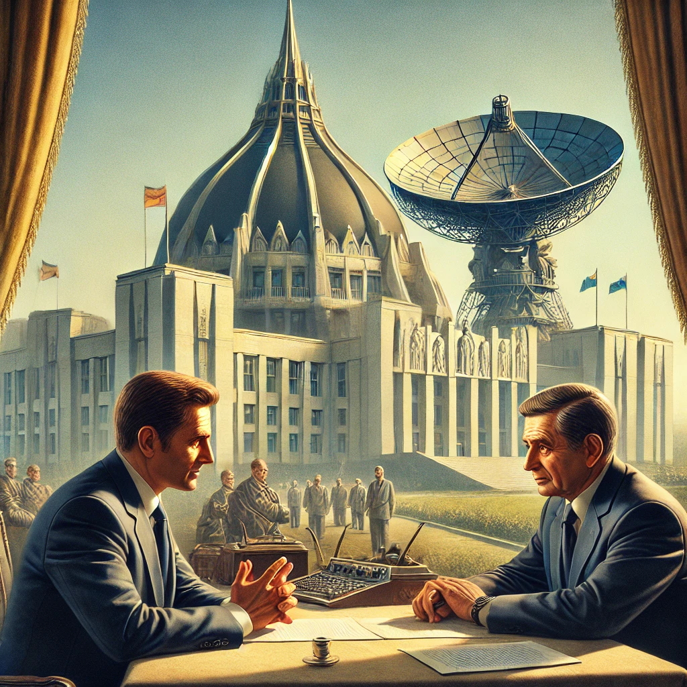

# parley

## parley という単語の意味を、例文とあわせて教えてください

parleyは「会談、協議、交渉」という意味の名詞、または「話し合う、協議する」という意味の動詞として使われます。特に、対立する勢力間での話し合いを指すことが多いです。

例文をいくつかご紹介します：

名詞として:

 * The two armies agreed to a parley before the battle began. (両軍は戦闘開始前に会談に合意した)
 * The pirates raised a white flag to request a parley with the navy. (海賊たちは白旗を掲げ、海軍との会談を要請した)

動詞として:

 * The diplomat tried to parley with the rebel forces to reach a peaceful solution. (外交官は平和的な解決策を見出すため、反乱軍との協議を試みた)
 * The union representatives parleyed with management for better working conditions. (労働組合の代表者たちは、より良い労働条件を求めて経営陣と交渉した)

この単語は古フランス語の「parler（話す）」に由来し、現代では特に公式な外交や軍事的な文脈で使用されることが多いです。映画「パイレーツ・オブ・カリビアン」シリーズでも、海賊の交渉の際によく使用されていました。

## 語源を教えてください

parleyの語源を詳しく説明いたします：

直接の語源：

 * 中世フランス語（Old French）の「parlee」から来ています
 * これは「話し合い、会話」を意味する名詞でした

さらに遡ると：

 * 古フランス語の動詞「parler」（話す）に由来します
 * この「parler」は俗ラテン語の「parabolare」から発展しました
 * 「parabolare」は「たとえ話をする」という意味を持っていました

最も古い起源：

 * ラテン語の「parabola」（たとえ話、比喩）にまで遡ります
 * これはギリシャ語の「παραβολή」（parabolē、比較、類推）から借用されました

英語への導入：

 * 11世紀後半から12世紀初頭にかけて、ノルマン征服の影響で英語に入ってきました
 * 当初は軍事用語として、敵対する軍隊間での会談を指す言葉として使用されていました

このように、単純な「話す」という意味から、より特殊な「交渉のための会談」という意味に発展していった興味深い語史を持つ単語です。

## パラボラアンテナのパラボラとは関係ありますか？

はい、実は関係があります！

パラボラアンテナの「パラボラ」も、同じギリシャ語の「παραβολή」（parabolē）に由来しています。ただし、こちらは数学的な意味で使われる「放物線」（parabola）としての用法です。

つまり：

 * parley の語源となった παραβολή は「比較、類推、たとえ話」という意味で使われ、「話し合い」という意味に発展しました
 * パラボラアンテナの「パラボラ」の語源となった παραβολή は、数学的な「放物線」という意味で使われています。これは、2つの点の関係を表す際の「比較」「対比」という原義から、数学的な曲線の性質を表す用語として発展したものです

このように、同じギリシャ語の単語から、

 * 「比較」→「たとえ話」→「話し合い」（parley）
 * 「比較」→「数学的な関係」→「放物線」（parabola） という2つの異なる意味の発展経路をたどったことがわかります。

## 発音はpartyと似ていますか？

いいえ、発音は異なります：

 * parley: /ˈpɑːrli/ （パーリー）
 * party: /ˈpɑːrti/ （パーティ）

主な違いは末尾の音です：

 * parleyは「リー」で終わります（"lee"のような音）
 * partyは「ティ」で終わります（"tea"のような音）

英語の発音記号で見ると：

 * parleyは-li で終わる
 * partyは-ti で終わる

ストレスは両方とも最初の音節「パー」にあります。また、最初の「par-」の部分は両方とも同じ発音です。

アメリカ英語とイギリス英語でも、この単語の発音に大きな違いはありません。

## parlorもparleyと同じ語源を持ちますか？

はい、その通りです！parlorも同じ語源を持ちます。

etymologyを順に見ていきましょう：

parlor:

 * 中世英語 "parlour"
 * 古フランス語 "parleor" (話す場所)
 * 俗ラテン語 "parabolare" (話す)
 * ラテン語 "parabola"
 * ギリシャ語 "παραβολή" (parabolē)

parley:

 * 中世フランス語 "parlee"
 * 古フランス語 "parler" (話す)
 * 俗ラテン語 "parabolare" (話す)
 * ラテン語 "parabola"
 * ギリシャ語 "παραβολή" (parabolē)

つまり、両方とも「話す」を意味する古フランス語から派生し、さらに遡ると同じラテン語とギリシャ語のルーツを持っています。

意味の発展の違い：

 * parlor → 「会話をする場所」という意味で、特に修道院や大きな邸宅での応接室を指すようになりました
 * parley → 「話し合い、交渉」という行為そのものを指すようになりました

余談ですが、フランス語の「parler（話す）」も同じ語源から来ています。また、英語の「parliament（議会）」も同じ語族に属しています。

## partyの政党・懇親会という意味と、parleyの協議・会談という意味は、近いように思えるのですが、偶然なのですね？

ご指摘ありがとうございます。実は私の説明が不完全でした。

partyとparleyは、実際には別々の言葉ではありますが、語源的にはある程度関連があります：

party の語源:

 * 中世英語 "partie"
 * 古フランス語 "partie" (部分、グループ、側)
 * ラテン語 "partita" (分けられた、部分)
 * ラテン語 "partire" (分ける、分割する)

一方、
parley の語源:

 * 古フランス語 "parlee"
 * 古フランス語 "parler" (話す)
 * 俗ラテン語 "parabolare"

このように、直接の語源は異なりますが、どちらもフランス語経由で英語に入った単語です。

そして、ご指摘の通り、意味的には確かに重なる部分があります：

 * 両方とも人々が集まって交流する場面で使われる
 * 集団での意思決定や交渉という文脈で使われる
 * 特に政治的な文脈では、意味が近接する（政党[party]間での会談[parley]など）

この意味的な類似性は、中世の宮廷文化や政治文化の中で、これらの単語が相互に影響し合いながら発展してきた可能性を示唆しています。完全な「偶然」というよりは、社会的・文化的な文脈の中で意味が近づいていったと考えられます。

申し訳ありません。先ほどの説明で、これらの単語の関連性について十分に触れなかったことをお詫びいたします。

## party は、現代英語の「部分」partに関係があるのですね！

その通りです！とても鋭い気づきですね。

partとpartyは同じラテン語の語根から来ています：

 * ラテン語の「pars, partis」（部分）が基になっています
 * そこから派生した動詞「partire」（分ける、分割する）

この語根から、多くの英単語が派生しました：

 * part（部分）
 * party（集団、グループ → 政党、パーティー）
 * partial（部分的な）
 * participate（参加する → 文字通りには「部分として加わる」）
 * partition（分割、区分）
 * partner（相手、仲間 → 全体の「一部」として協力する人）
 * department（部門）
 * apartment（アパート → 建物の「区分」された一部）

「party」が「パーティー、宴会」や「政党」という意味になったのは以下のような変遷によります：

 * 「部分、一部」という意味から
 * 「グループ、集団」（全体の中の一部分としての集団）という意味が生まれ
 * そこから「社交的な集まり」や「政治的な集団」という意味に発展

このように、「分ける、部分」という基本的な概念から、社会的な「集団」や「集まり」を表す言葉へと意味が発展していった興味深い例です。

## partyは部分、parleyは話す、が由来なのですね。よくわかりました

はい、その通りです！とても簡潔にまとめていただきました。

party: 「部分」（ラテン語 pars, partis） → グループ → 社交の集まり、政党
parley: 「話す」（古フランス語 parler） → 交渉、会談

この会話を通じて、一見似ているように見える2つの単語が、実は異なる語源を持ちながら、中世の社会・政治的な文脈の中で意味的に近い用途で使われるようになっていったことがわかりましたね。

また、それぞれの語族が現代英語の中で広がっていることも見えてきました：

 * party/part の語族 → partial, participate, partner など
 * parley/parlor の語族 → parliament, parlance（話し方）など

語源をたどることで、単語の意味の発展と言語の歴史が見えてくるのは、とても興味深いですね。

## parlay という単語もあるのですね。この意味と語源を教えてください

parlayについて説明いたします：

語源：

 * parleyの異形（variant spelling）として始まりました
 * 主にアメリカ英語で使われる綴りです
 * 同じく古フランス語の「parler（話す）」に由来します

意味：

 * （parleyと同じく）交渉、会談
 * （ギャンブル用語として）
   * 賭け金や勝ち金を次の賭けに回して増やすこと
   * 例：He parlayed his initial $100 bet into $1000
   * 「少額の賭け金を次々と賭けて大金にする」という意味
 * （比喩的に）
   * 何かを活用して、より大きな利益や成功に変えること
   * 例：She parlayed her YouTube success into a successful TV career
   * 「（何かを）より大きな成功に転換する」という意味

このように、parlayは元々parleyと同じ「話し合い」という意味でしたが、特にアメリカで「賭け金を増やす」という独自の意味を発展させ、そこからさらに比喩的な用法が生まれました。

面白いことに、「話し合い」という原義からギャンブル用語として発展したのは、おそらく賭け事での交渉や取引という側面が関係していると考えられます。

---
Claude 3.5 Sonnet
