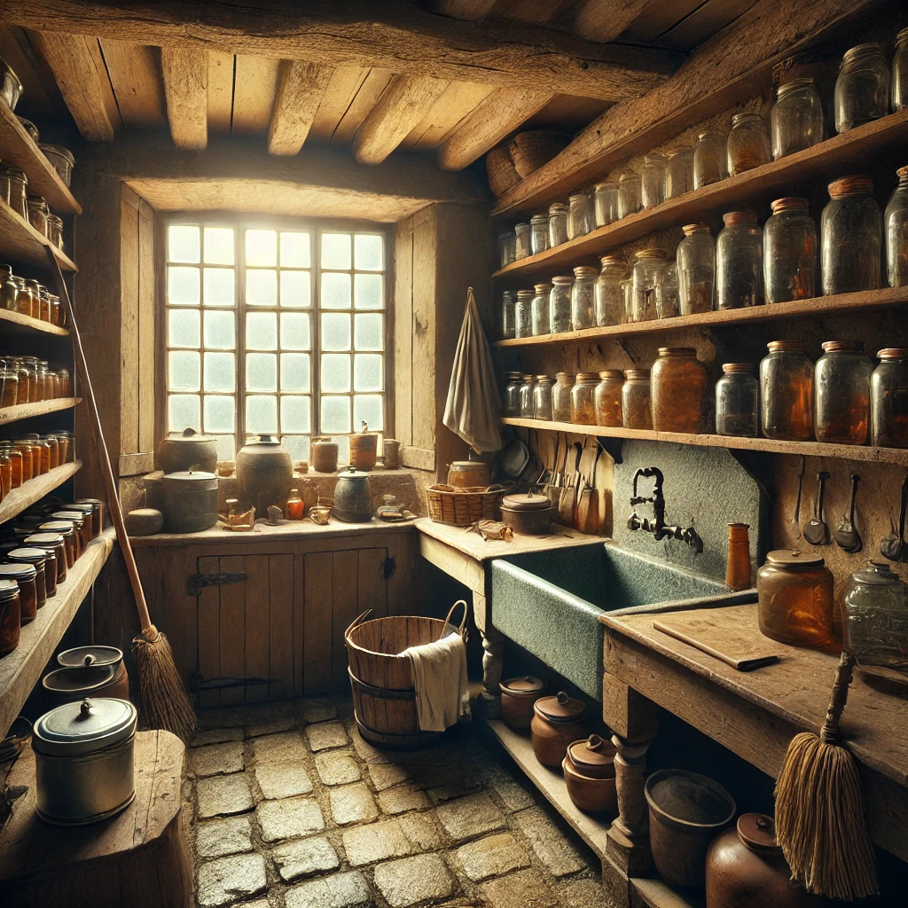

# scullery

## scullery という単語の意味を、例文とあわせて教えてください

scullery は、主に英国の伝統的な邸宅や古い家屋で見られる、台所に付随する小さな作業部屋を指します。主に食器洗いや食事の準備、掃除用具の保管などに使用される実用的な空間です。

意味をより具体的に説明すると：

- 食器洗いや下準備をする場所
- 調理器具や掃除道具を保管する場所
- メインの台所（kitchen）とは別の、より作業的な空間

例文をいくつかご紹介します：

- "The maid spent hours in the scullery washing dishes after the dinner party." （メイドは夕食会の後、何時間もsculleryで食器を洗っていました）
- "All the cleaning supplies were kept in the scullery, away from the main kitchen area." （すべての掃除用具は、メインの台所エリアから離れたsculleryに保管されていました）
- "In Victorian houses, the scullery was where all the messy work was done, keeping the kitchen clean for cooking." （ビクトリア朝の家では、sculleryですべての汚れる作業が行われ、台所は料理のために清潔に保たれていました）

現代では、特に新しい建物ではsculleryを見かけることは少なくなっていますが、歴史的な建造物や伝統的なイギリスの住宅では今でも残っていることがあります。

## 食器や食材の汚れを落とすような作業は kitchen と別の部屋で行われていたということでしょうか

はい、その通りです。伝統的な英国の家屋では、食材の下処理や食器洗いなどの「汚れる作業」は、メインの台所（kitchen）とは意図的に分けられていました。これには主に以下のような理由がありました：

- 衛生管理

- kitchenを調理に特化した清潔な空間として保つため
- 生の食材や汚れた食器からの交差汚染を防ぐため

- 社会的・実用的な理由

- 使用人が働くsculleryと、料理人が料理をするkitchenを分けることで、作業の効率を上げる
- 食器洗いの音や水しぶき、生の食材の臭いなどを調理空間から分離する

- 温度・湿度管理

- 食器洗いなどで発生する蒸気や湿気をkitchenから分離
- 調理に適した環境を維持する

典型的な作業の流れとしては：

- sculleryで野菜の泥を落とす、魚をさばく、食器を洗うなどの作業
- きれいになった食材や道具をkitchenに運び、そこで実際の調理を行う

この考え方は、現代の業務用キッチンにも引き継がれており、「汚染区域」と「非汚染区域」を分ける考え方の原点の一つとなっています。

## 語源をおしえてください

sculleryの語源を辿ると、中世ラテン語の「scutellarius」（食器係）にまで遡ります。

この語の変遷を時系列で見ていくと：

- ラテン語「scutella」（皿、食器） ↓
- 中世ラテン語「scutellarius」（食器係） ↓
- 古フランス語「escuelerie」（食器を扱う場所/仕事） ↓
- 中世英語「squilery」「scullery」

15世紀頃から英語で使用され始め、当初は「食器を扱う人」や「食器を扱う仕事」という意味でしたが、次第に「食器を扱う場所」という意味に変化していきました。

「scullery maid」（食器洗い係の女中）という言葉も、この語源から派生しています。家事使用人の中で最も地位が低い仕事の一つとされ、主にsculleryでの作業を担当していました。

このように、語源的には「食器」に関連する言葉から発展し、その後、食器洗いを含む様々な下準備作業を行う空間を指す言葉として定着していったことがわかります。

## cutlery と関係はありますか？

cutleryとsculleryは、一見似ているように見えますが、異なる語源を持っています。

cutlery の語源：

- 古フランス語の「coutelerie」から来ています
- これは「coutelier」（刃物職人）に由来
- さらに遡ると、ラテン語の「cultellus」（小さなナイフ）が語源
- つまり、「刃物、刃物類」という意味から発展した単語です

一方、先ほど見たように scullery は：

- ラテン語の「scutella」（皿、食器）から
- 中世ラテン語「scutellarius」（食器係）を経て
- 古フランス語「escuelerie」から発展

このように、両者は：

- cutleryは「刃物、ナイフ」からの派生
- sculleryは「皿、食器」からの派生

と、異なる語源を持つ単語であり、直接の関係はありません。ただし、どちらも食事や食器に関連する用語として、kitchen文化の中で重要な位置を占めているという点では共通しています。

## 中世ラテン語「scutellarius」（食器係）は職業ですか？

はい、scutellariusは中世の宮廷や大きな邸宅で働いていた職業の一つでした。

具体的な職務内容としては：

- 食器の管理と洗浄
- 食器の保管
- 食事の際の食器の準備と片付け
- 銀食器などの貴重な食器の手入れ

中世の大きな屋敷では、職業の階層構造が明確に存在し、scutellariusはキッチンスタッフの一部として位置づけられていました。

この職業は後に英国では「scullery maid」（女性の場合）や「scullery boy」（男性の場合）として発展していきました。特に「scullery maid」は、ビクトリア朝時代の使用人階層の中で最も地位が低い仕事の一つとされていました。

興味深いのは、この職業名が後に部屋の名称（scullery）となっていった点です。これは、その作業を行う専用の空間が必要とされ、次第にその空間自体が「scullery」と呼ばれるようになっていったことを示しています。

## scullery が存在するような昔の邸宅に存在した、他の部屋や設備の名前を教えてください

イギリスの伝統的な大きな邸宅には、機能別に多くの部屋が存在していました。主な部屋や設備を、特に使用人エリアを中心にご紹介します：

サービスエリア（地下や裏側）：

- kitchen（メインの台所）
- scullery（食器洗いや下準備用の部屋）
- pantry（食料品の保管室）- これはさらに以下のように分かれることも：
  - dry pantry（乾物用）
  - wet pantry（飲み物用）
- larder（生鮮食品の保管室）
- buttery（ワインや酒類の保管室）
- servants' hall（使用人の食事・休憩室）
- boot room（靴や外套を置く部屋）
- laundry room（洗濯室）
- stillroom（ジャムや漬物を作る部屋、お茶の準備も）

メインフロア（家族や客用）：

- drawing room（応接間）
- dining room（食堂）
- morning room（朝の日光を取り入れる部屋）
- library（書斎）
- conservatory（温室を兼ねた居間）
- parlour（家族用の居間）

寝室エリア：

- master bedroom（主寝室）
- dressing room（着替えの部屋）
- nursery（子供部屋）
- governess' room（家庭教師の部屋）

これらの部屋は、家の規模や時代によって存在したりしなかったりと、バリエーションがありました。また、廊下や階段も、使用人用と家族・客用で完全に分けられていることが一般的でした。

このような複雑な部屋の配置は、当時の社会階級の区分と、効率的な家事労働の必要性を反映したものでした。

## buttery（ワインや酒類の保管室）はバターと関係がありますか？

buttery の語源を調べると、面白いことに、実はバター（butter）とは関係がありません。

語源：

- 中世ラテン語の「buttis」（樽、特にワインの樽）から来ています
- 古フランス語の「boterie」（瓶や樽を保管する場所）を経て
- 中世英語で「botry」「buttery」となりました

当初は：

- ワインや ale（エール）などの飲み物を樽で保管する場所
- それらの飲み物を管理する役職（butler）の作業場所

として使われていました。

実際、現代でも使われる「butler」（執事）という職名も、この「buttery」と同じ語源を持っています：

- 中世ラテン語「butticularius」（ワイン係）
- 古フランス語「bouteillier」（ワイン係）
- 中世英語「butler」

つまり、buttery は「butter（バター）+ y」ではなく、「樽に入った飲み物」に関連する言葉だったのです。時代とともに、その役割は拡大し、一般的な飲み物の保管・管理を行う場所となっていきました。

これは、中世の言葉の多くが、見た目の類似性があっても、実際には全く異なる語源を持っている良い例と言えます。

## ラテン語の「cultellus」（小さなナイフ）と「scutella」（皿、食器）には、語源的なつながりはないのですね

はい、この2つの単語は異なる語源を持っています。

「cultellus」（小さなナイフ）の語源：

- ラテン語の「culter」（ナイフ、刃物）の指小辞形
- インド・ヨーロッパ語根の *(s)kel-（切る、裂く）から派生
- 同じ語根から、英語の「shear」（切る）なども派生しています

一方、「scutella」（皿、食器）の語源：

- ラテン語の「scutra」（皿、平たい容器）から派生
- これは「scutum」（盾）と関連があるとされる
- 平たい形状という共通点から発展した可能性が指摘されています

このように、両者は：

- cultellus は「切る」という動作に関連
- scutella は「平たい容器」という形状に関連

と、異なる語源を持つ単語であることがわかります。

ちなみに、scutumから派生した言葉には「escutcheon」（紋章）なども含まれており、「平たい盾のような形状」という意味的なつながりを見ることができます。

---
Claude 3.5 Sonnet
